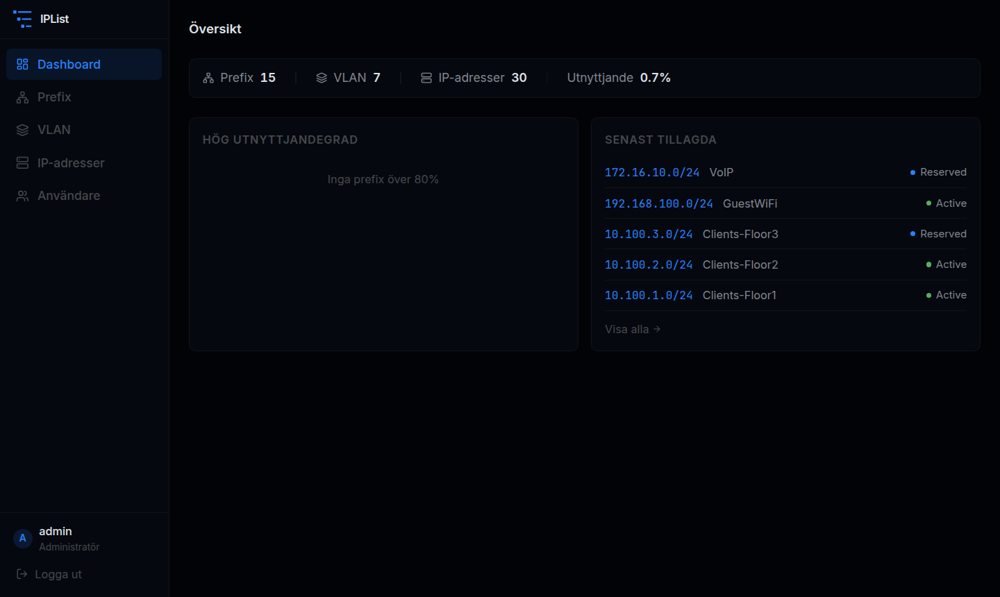
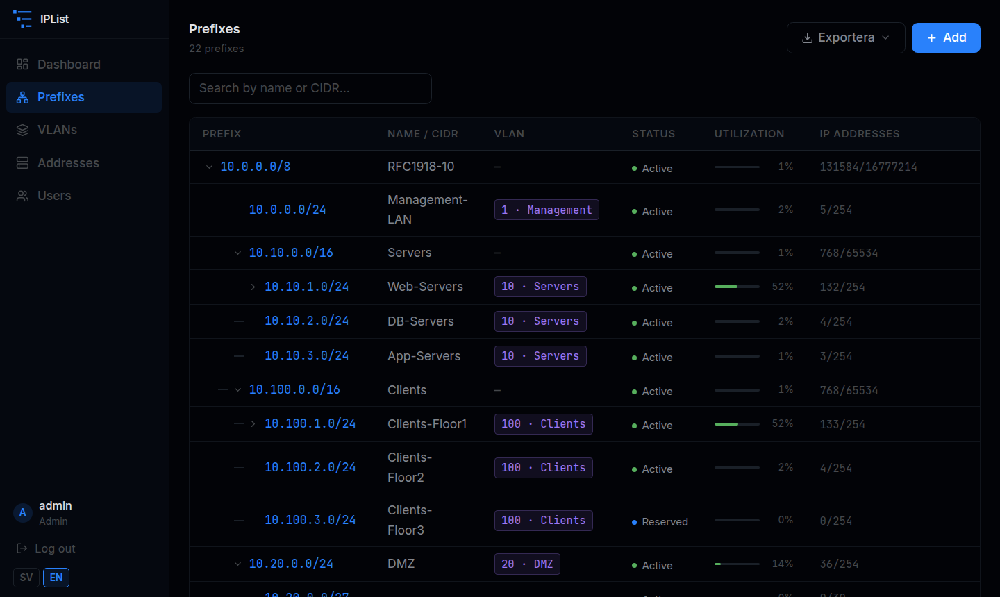
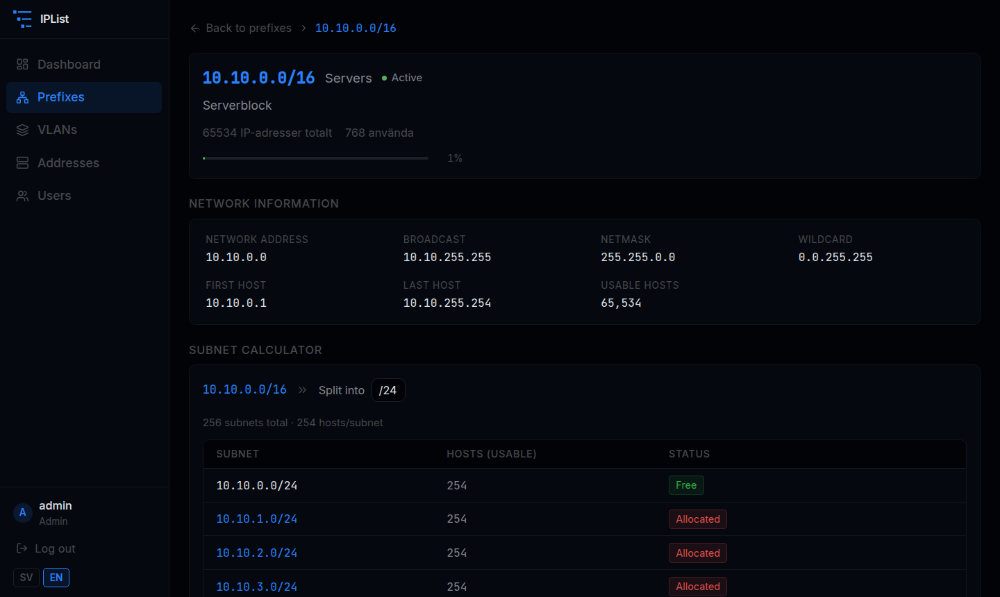
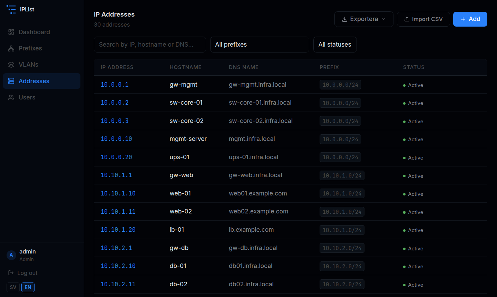
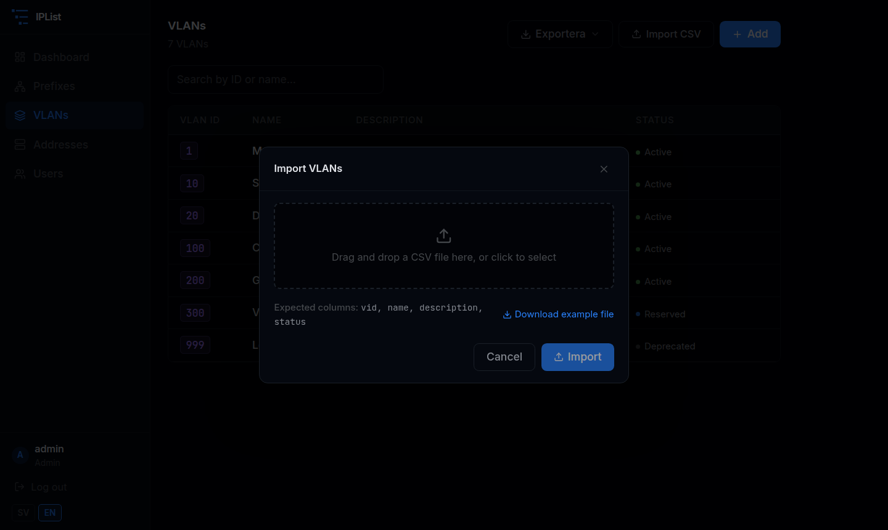

# IPList

A self-hosted IP Address Management (IPAM) tool for tracking VLANs, IP prefixes, and individual IP addresses. Built with a Go backend and a React frontend, packaged as a two-container Docker application.

## Features

- **VLAN management** — create and manage VLANs with status tracking
- **Prefix management** — hierarchical prefix tree with utilization bars, supports IPv4 and IPv6
- **Subnet calculator** — split any prefix into smaller blocks, see which subnets are already allocated, and create new prefixes directly from the calculator
- **IP address tracking** — hostname, DNS name, description, and status per address
- **Role-based access control** — `admin` (full access) and `read` (read-only) roles with JWT authentication
- **Data export** — download any list as CSV, JSON, or YAML
- **CSV import** — bulk-import VLANs and IP addresses from CSV files; partial success with per-row error reporting
- **Numeric IP sorting** — addresses sorted correctly by numeric value, not lexicographically
- **Dark UI** — monospace-accented dark theme
- **Multilingual** — Swedish and English built-in, with an extensible language file system for adding more

## Screenshots











## Tech stack

| Layer    | Technology                                      |
|----------|-------------------------------------------------|
| Backend  | Go 1.24, chi router, modernc SQLite (pure Go)  |
| Auth     | JWT (HS256, 24 h expiry), bcrypt passwords      |
| Frontend | React 18, TypeScript, Vite, Tailwind CSS        |
| Routing  | React Router v6                                 |
| Serving  | Nginx (frontend), Go HTTP server (backend)      |
| Storage  | SQLite with WAL mode, persisted via Docker volume |

## Getting started

### Option 1 — Docker Compose (recommended)

**1. Clone the repo and create a config file:**

```bash
git clone https://github.com/acidflash/iplist.git
cd iplist
cp config.example.json config.json
```

**2. Edit `config.json` and set a strong JWT secret:**

```json
{
  "db_path":    "/data/iplist.db",
  "jwt_secret": "replace-with-a-long-random-string",
  "port":       "8080"
}
```

Generate a secret with:

```bash
openssl rand -hex 32
```

**3. Start the application:**

```bash
docker compose up -d
```

The app is available at [http://localhost:8080](http://localhost:8080).

**Default credentials — change these immediately after first login:**

| Username | Password | Role  |
|----------|----------|-------|
| admin    | admin    | Admin |
| reader   | reader   | Read  |

---

### Option 2 — Run the binary directly

Build the backend and serve the frontend with any static file server.

```bash
# Build backend
cd backend
go build -o iplist .

# Run with config file (default: config.json in working directory)
./iplist -config /etc/iplist/config.json

# Or use a custom config path
./iplist -config ./myconfig.json
```

Environment variables override values in the config file:

```bash
JWT_SECRET=mysecret DB_PATH=/data/iplist.db ./iplist
```

---

### Development

```bash
docker compose -f docker-compose.dev.yml up
```

Hot-reload is enabled for both the Go backend (`air`) and the Vite frontend dev server.

---

## Configuration

Settings are loaded from a JSON config file. Environment variables always take precedence over the file.

| Key / Env variable          | Default                    | Description                 |
|-----------------------------|----------------------------|-----------------------------|
| `db_path` / `DB_PATH`       | `iplist.db`                | Path to the SQLite database |
| `jwt_secret` / `JWT_SECRET` | `change-me-in-production`  | Secret key for signing JWTs |
| `port` / `PORT`             | `8080`                     | Port the server listens on  |

The config file path defaults to `config.json` in the working directory and can be changed with the `-config` flag. If the file does not exist, the application falls back to environment variables and built-in defaults.

## API

The REST API is available under `/api/v1/`. All endpoints except `POST /auth/login` require a `Bearer` token.

| Method | Path                  | Role  | Description            |
|--------|-----------------------|-------|------------------------|
| POST   | /auth/login           | —     | Obtain JWT token       |
| GET    | /auth/me              | read  | Current user info      |
| GET    | /stats                | read  | Dashboard stats        |
| GET    | /vlans                | read  | List VLANs             |
| POST   | /vlans                | admin | Create VLAN            |
| POST   | /vlans/import         | admin | Import VLANs from CSV  |
| PUT    | /vlans/:id            | admin | Update VLAN            |
| DELETE | /vlans/:id            | admin | Delete VLAN            |
| GET    | /prefixes             | read  | List prefixes          |
| GET    | /prefixes/:id         | read  | Get prefix with IPs    |
| GET    | /prefixes/:id/subnets | read  | Split prefix into subnets (`?prefix_len=N`) |
| POST   | /prefixes             | admin | Create prefix          |
| PUT    | /prefixes/:id         | admin | Update prefix          |
| DELETE | /prefixes/:id         | admin | Delete prefix          |
| GET    | /addresses            | read  | List IP addresses      |
| POST   | /addresses            | admin | Create IP address      |
| POST   | /addresses/import     | admin | Import addresses from CSV |
| PUT    | /addresses/:id        | admin | Update IP address      |
| DELETE | /addresses/:id        | admin | Delete IP address      |
| GET    | /users                | admin | List users             |
| POST   | /users                | admin | Create user            |
| PUT    | /users/:id            | admin | Update user            |
| DELETE | /users/:id            | admin | Delete user            |

## License

MIT
